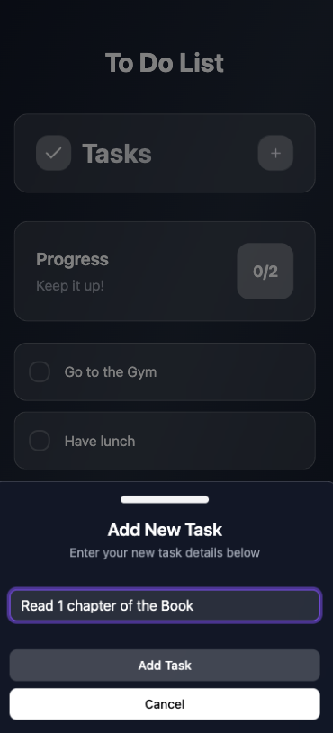
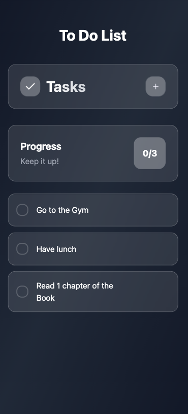
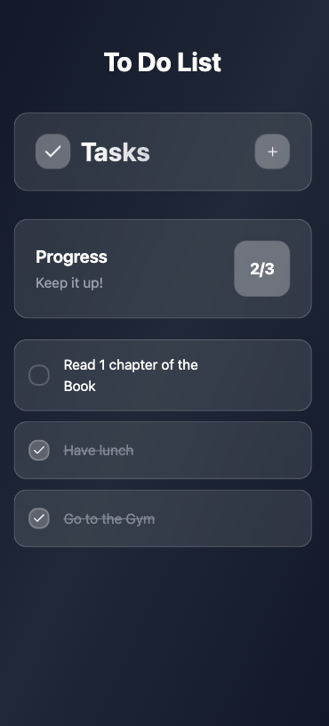
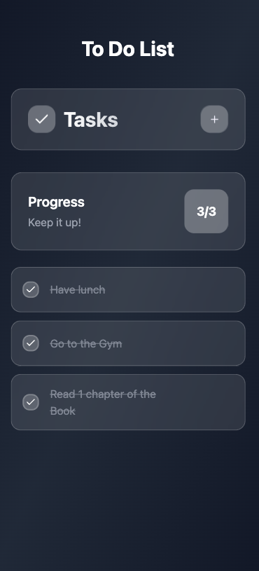

# Full-Stack Web Application

This is a modern full-stack web application designed and developed to demonstrate clean architecture, production readiness, and end-to-end functionality. It reflects strong engineering principles, leveraging a contemporary technology stack across both frontend and backend, complete with CI/CD pipelines and cloud deployment.

---

## Tech Stack

### Frontend

- Vite – Fast, modern build tool
- React – Component-based UI library
- TailwindCSS – Utility-first CSS framework
- shadcn/ui – Accessible, customizable UI components









### Backend

- .NET 9 – High-performance web framework
- C# – Modern, strongly typed programming language
- PostgreSQL – Robust relational database

### Infrastructure

- Vercel – CI/CD pipeline and frontend hosting
- Render.com – Containerized backend deployment
- Docker – Consistent deployment and development environments

---

## Architecture

This project follows a service-oriented architecture with a clear separation between frontend and backend layers. The application communicates over secure RESTful APIs, and all services are containerized for scalability and portability.

Frontend (Vite + React + TailwindCSS + shadcn)
│
CI/CD via Vercel
│
REST API
(.NET 9 + C# Backend)
│
Dockerized Services
│
Deployed to Render.com
│
PostgreSQL Database

---

## Features

- Fast, reactive frontend with Vite and TailwindCSS
- Modular backend architecture with .NET 9
- Secure, RESTful API layer
- Full containerization using Docker
- Managed PostgreSQL database
- End-to-end CI/CD with automatic deployment on push

---

## Getting Started

### Prerequisites

- Node.js
- Bun
- .NET 9 SDK
- Docker

### Frontend Setup

```bash
bun install
bun run dev
Backend Setup
bash
Copy
Edit
dotnet build
dotnet run
Deployment Workflow
Frontend
The frontend is deployed using Vercel. Every push to the main branch triggers an automatic build and deployment via Vercel's CI/CD pipeline.

Backend
The backend is containerized with Docker and deployed to Render.com. Render continuously monitors the source repository and redeploys on changes. It connects to a managed PostgreSQL instance for persistent data storage.
```
